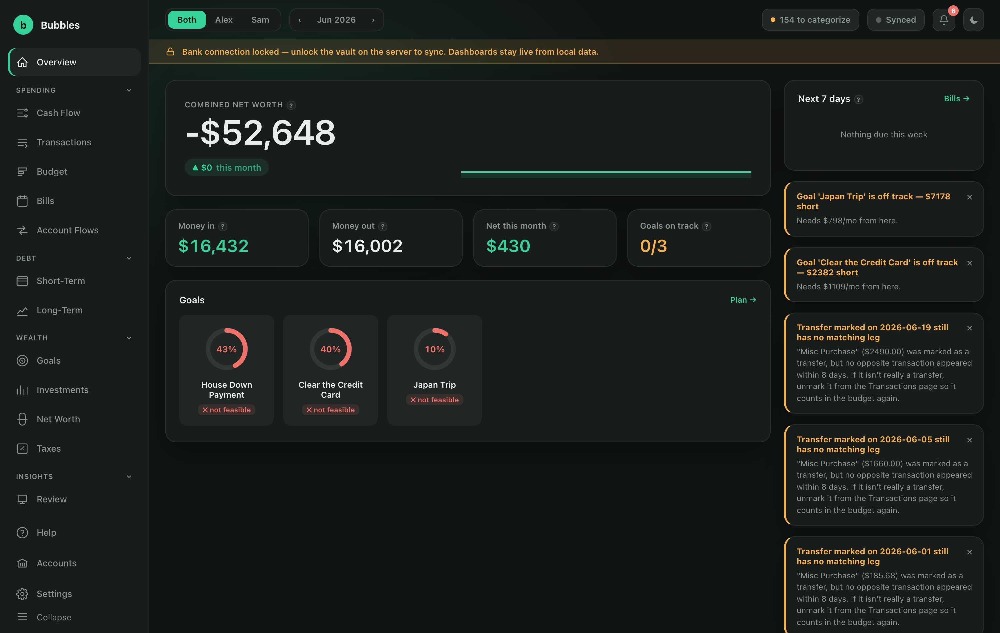
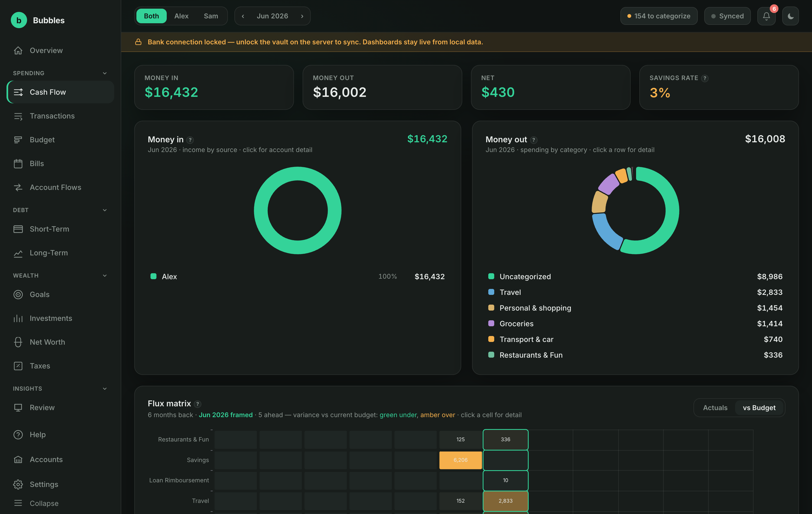
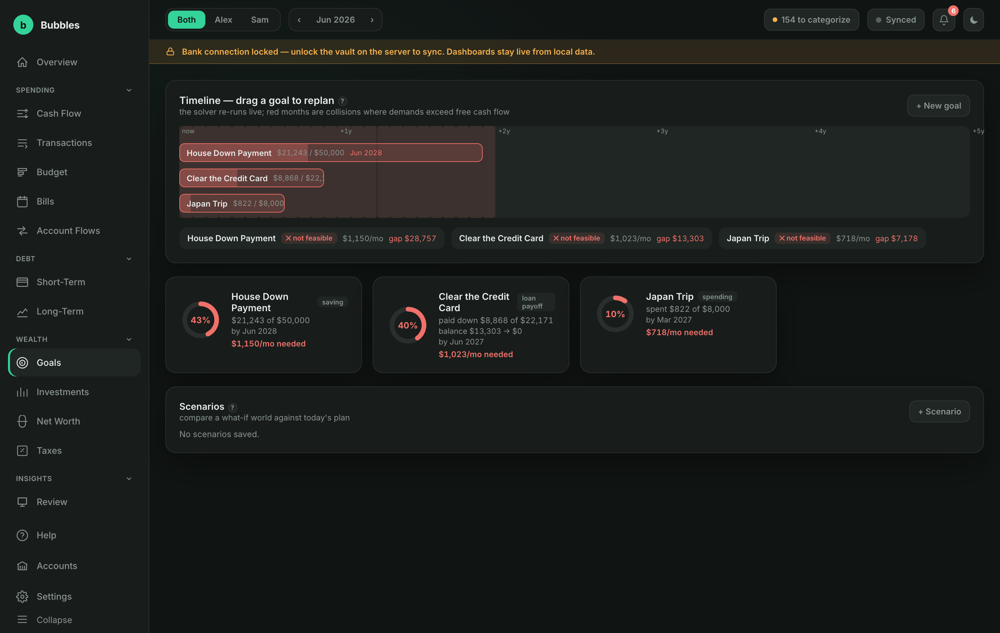
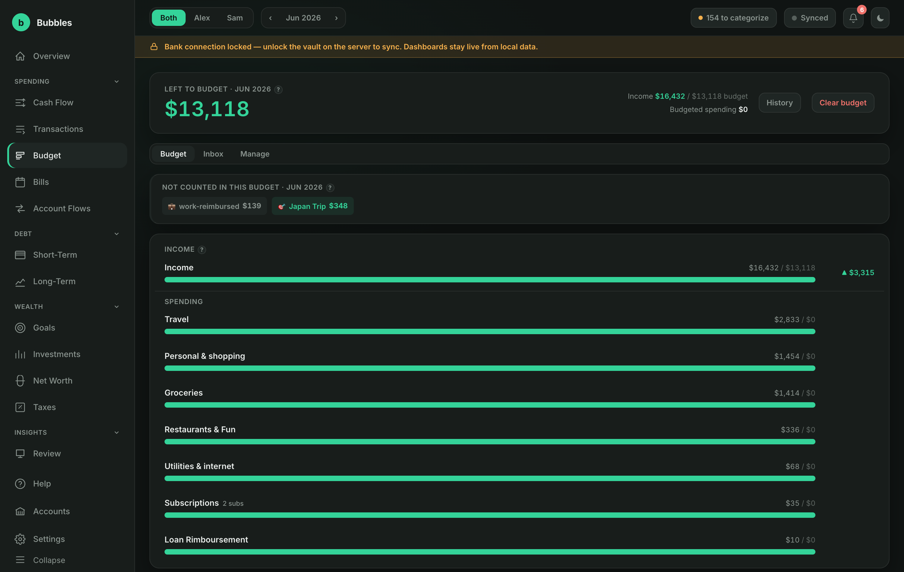
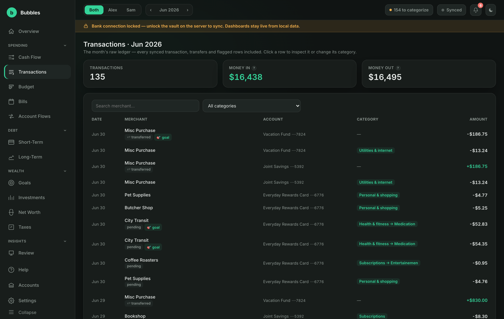

<div align="center">

# 🫧 Bubbles

### A private, local-first finance tracker for households

Bubbles links your bank accounts through Plaid, keeps every balance and transaction in a local SQLite database, and turns them into budgets, cash-flow analytics, debt payoff plans, and savings goals, all on your own machine. Nothing leaves the computer except the calls to Plaid itself, and every API key is sealed in a vault that only opens with a physical **YubiKey**.

<br/>


<sub>Built by **Nicholas Massad**</sub>

</div>

---

> [!NOTE]
> **Bubbles is a work in progress.** It's an actively evolving personal project, so features land and change often and rough edges are expected. **Feedback, ideas, and bug reports are very welcome**, so please [open an issue](../../issues) or start a discussion.

---

## 📸 A look inside

<div align="center">

**Overview:** combined net worth, monthly cash flow, and goal progress at a glance



</div>

<table>
  <tr>
    <td width="50%" valign="top">
      <strong>Cash Flow</strong><br/>
      <sub>Money in vs. out, savings rate, and a month-by-month flux matrix vs. budget.</sub><br/><br/>
      
    </td>
    <td width="50%" valign="top">
      <strong>Goals</strong><br/>
      <sub>Saving, spending, and loan-payoff goals on one feasibility-solved timeline.</sub><br/><br/>
      
    </td>
  </tr>
  <tr>
    <td width="50%" valign="top">
      <strong>Budget</strong><br/>
      <sub>Per-category budgets with an AI-assisted inbox for uncategorized spending.</sub><br/><br/>
      
    </td>
    <td width="50%" valign="top">
      <strong>Transactions</strong><br/>
      <sub>The full synced ledger: searchable, filterable, and re-categorizable.</sub><br/><br/>
      
    </td>
  </tr>
</table>

<sub>The data shown above is anonymized demo data.</sub>

## ✨ Features

- **🏦 Bank sync via Plaid:** link accounts once, then pull balances and transactions incrementally (cursor-based, only what changed).
- **📊 Budgets & cash flow:** per-person and combined budgets, income vs. spend, savings rate, and a variance flux matrix.
- **🎯 Goals, three kinds.** Every goal is one of:
  - **Saving:** tracks a linked account's balance up toward a target.
  - **Spending:** its own envelope for a one-off (a trip, a big gift); tagged transactions skip the household budget and count here.
  - **Loan payoff:** tracks a debt down to a target balance by a date, advancing as you pay it off.
  
  A live affordability solver checks whether your goals, debts, and contributions all fit your free cash flow; drag a goal's date and it re-plans instantly.
- **💳 Debt tracking:** short- and long-term debts, avalanche/snowball payoff strategies, and interest projections.
- **🤖 AI expense inbox** *(optional)*: a Gemini-backed assistant proposes a category or goal for each unclassified transaction.
- **📈 Net worth, investments & taxes:** registered-account room (FHSA/TFSA/RRSP), holdings, and Québec/Canada tax estimates.
- **🔐 Local-first & private:** everything lives in one SQLite file on your machine; the only outbound calls are to Plaid.

## 🧱 Tech stack

| Layer | Tech |
|---|---|
| Backend | Node.js · TypeScript · Express · [better-sqlite3](https://github.com/WiseLibs/better-sqlite3) |
| Frontend | React · Vite · TanStack Query · Zustand |
| Data | Plaid API · local SQLite (WAL mode) |
| Secrets | [`age`](https://github.com/FiloSottile/age) + [`age-plugin-yubikey`](https://github.com/str4d/age-plugin-yubikey) |
| Deploy | Docker · Docker Compose |

## 🔐 How the vault works

All Plaid API keys and per-bank access tokens live in an encrypted vault at `data/vault/secrets.age`. It's encrypted with [`age`](https://github.com/FiloSottile/age) to a recipient backed by your YubiKey's PIV applet, via [`age-plugin-yubikey`](https://github.com/str4d/age-plugin-yubikey). **Decrypting requires the physical key inserted, your PIV PIN, and a touch.** No custom cryptography is involved; Bubbles shells out to those two audited tools for every encrypt/decrypt.

**Session grants** let the server run unattended for up to 30 days: `vault grant-session` unlocks the vault with your YubiKey once, then re-seals the secrets under a freshly generated random key stored in the macOS Keychain (expiry enforced in code). A running server detects a fresh grant within a minute, with no restart needed. When a grant expires, sync locks again until you touch the YubiKey and re-run `grant-session`; **the dashboards keep working from local data throughout.**

## 🚀 Getting started

### Prerequisites

- **Node.js 22+** and npm
- A **YubiKey** with a free PIV slot (a factory-default key works out of the box)
- `age` and `age-plugin-yubikey`:

```bash
brew install age age-plugin-yubikey
npm install
```

### 1 · Set up the key vault

Insert your YubiKey, then provision the vault (this generates a PIV identity on the key and creates the empty encrypted secrets file):

```bash
npm run vault -- init
```

Store your Plaid API keys. This is the **only** place Plaid credentials are ever written to disk, and it requires a YubiKey touch:

```bash
npm run vault -- set-plaid-keys --client-id <id> --secret <secret> --env sandbox
```

Handy vault commands:

```bash
npm run vault -- status              # show init + session-grant status
npm run vault -- grant-session --days 30   # run unattended for up to 30 days (YubiKey touch)
npm run vault -- revoke-session      # end a grant early
```

### 2 · Run in development

```bash
npm run dev          # backend (auto-reload) on http://127.0.0.1:4000
npm run web:dev      # frontend (Vite) on http://localhost:5173
```

On boot the server looks for a valid session grant; if there isn't one, it falls back to an interactive YubiKey unlock right there in the terminal.

To link a bank in Plaid **Sandbox**, open `http://127.0.0.1:4000/link-test.html` and use Plaid's test credentials (`user_good` / `pass_good`).

### 3 · Run in production (bare metal)

Build the backend and the web app, then start the compiled server:

```bash
npm run build        # compile the backend (tsc into dist/)
npm run web:build    # build the frontend (Vite into public/, served by the backend)
npm start            # node dist/index.js
```

The single Node process serves both the API and the built frontend on `http://127.0.0.1:4000`. Make sure a session grant is active (`npm run vault -- grant-session`) so the server can reach Plaid.

## 🐳 Docker deployment

> **Don't have Docker?** Install **[Docker Desktop](https://docs.docker.com/get-docker/)** first (macOS, Windows, or Linux).

Build and start the stack:

```bash
docker compose build
docker compose up -d
```

The API is published to `127.0.0.1:4000` only (never all interfaces), matching the local-only posture of the bare-metal setup.

### The host / container split

**The vault CLI always runs on the host, never in the container.** Docker can't pass a physical YubiKey's USB/PC-SC access through to a Linux container, so:

- **Host:** the only place that ever touches the physical key. `init`, `set-plaid-keys`, and `grant-session` all run here with plain `npm run vault -- <command>`.
- **Container:** only ever *consumes* an existing session grant. It boots **locked** when there's no valid grant (dashboards still work from local data) and unlocks itself as soon as a grant appears in the shared `./data`.

Grants for the container **must** be issued with `--portable`. The default stores the session key only in the macOS Keychain, which a Linux container can't read:

```bash
# All on the HOST, YubiKey required:
npm run vault -- init                                              # once
npm run vault -- set-plaid-keys --client-id <id> --secret <secret> # once
npm run vault -- grant-session --days 30 --portable                # every 30 days or less

docker compose up -d                                               # container serves the app; picks up grants live
```

Both host and container read/write the **same `./data` directory**, a bind mount (`./data:/app/data` in `docker-compose.yml`) rather than a Docker-managed volume, so the host-run vault CLI and the containerized server see identical files.

## ⚙️ Configuration

Copy `.env.example` to `.env` for local overrides (port, host, Plaid products/country codes, optional Gemini key). **None of these values are secret;** the actual Plaid credentials live only in the YubiKey vault.

```bash
set -a; source .env; set +a; npm run dev
```

## 💾 Data & privacy

Everything lives under `./data` (gitignored): the SQLite database (`finances.db`), the encrypted vault, and session-grant material. Nothing is sent anywhere except to Plaid's API. SQLite runs in WAL mode, so a clean shutdown always leaves a consistent database on disk, and the bind-mounted `./data` survives container restarts and recreates.

## 💬 Status & feedback

Bubbles is an evolving work in progress and a personal project, so expect frequent changes and the occasional rough edge. **All feedback is appreciated**: [open an issue](../../issues) with bugs, ideas, or questions.

<div align="center"><sub>Made with 🫧 by Nicholas Massad</sub></div>
